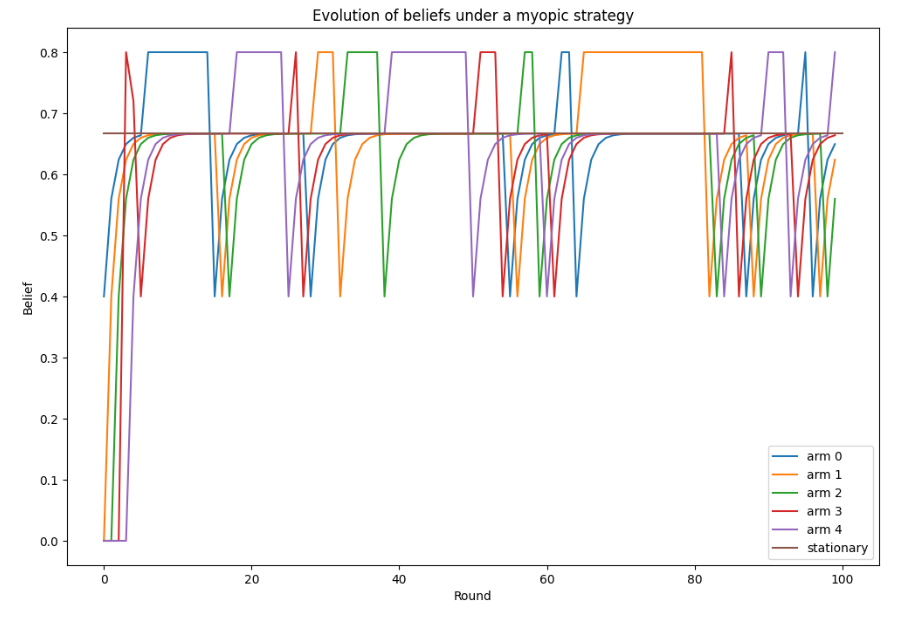
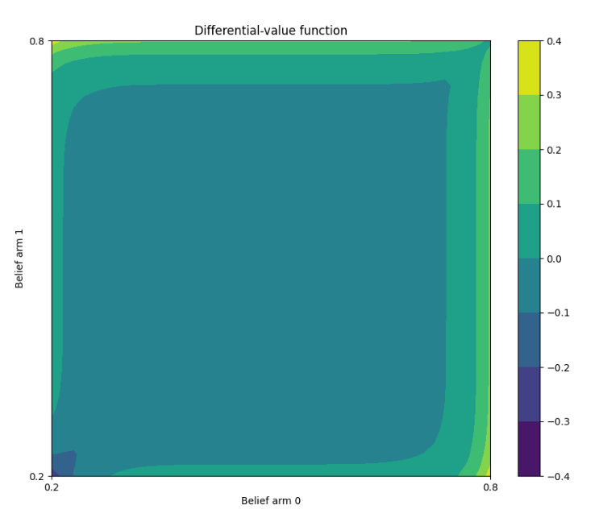

[](https://github.com/louisfaury/restless/actions/workflows/pylint.yml)
[](https://github.com/louisfaury/restless/actions/workflows/test.yml)
<a href="https://github.com/psf/black"></a>

*Reinforcement Learning (RL) and Control in Restless Multi-Arm Bandits (RMABs).*

The goal of this package is to experiment with RMAB environments. In this setting, a decision-maker can pull any of K independent arms. It then receives a reward, which value depends on the current _state_ of the selected arm. This state evolves at each round (wether the arm was pulled or not) according to some homogeneous, ergodic Markov Chain. 

This package is developed in order to compare policies (e.g. fixed-arm, myopic or optimal) and study the structure of the Partially Observable Markov Decision Process (POMDP) that is tied to RMAB. In particular,  this package implements control algorithms such as (discounted, relative) value iteration for the belief-MDP induced by RMAB environments.

A particuliar focus is put on a somehow simplified version of RMAB known as Opportunistic MultiChannelAccess -- in this case, all Markov Chain have only 2 states and share the same transition kernel. 
## Usage

Usage examples can be found in the folder `experiments/`. They include *e.g.* visulazing the belief trajectories under a myopic policy, running relative value iteration for the average-gain discounted MDP, visualizing differential values functions,  ..


<p float="left">
  
  
</p>


## Manual install

#### Create and activate virtualenv
```
python -m venv .venv/
source .venv/bin/activate
```

#### Install requirements and library
```
make install
```
For local development:
```
make install-dev
```

## Development
Running checks:
```
make lint
make black
make mypy
```
Running tests and coverage:
```
make test
make coverage
```

## Documentation
To update the docs:
```
sphinx-apidoc -f -o docs/source restless/
```
And generate the html files:
```
cd docs
make html
```

